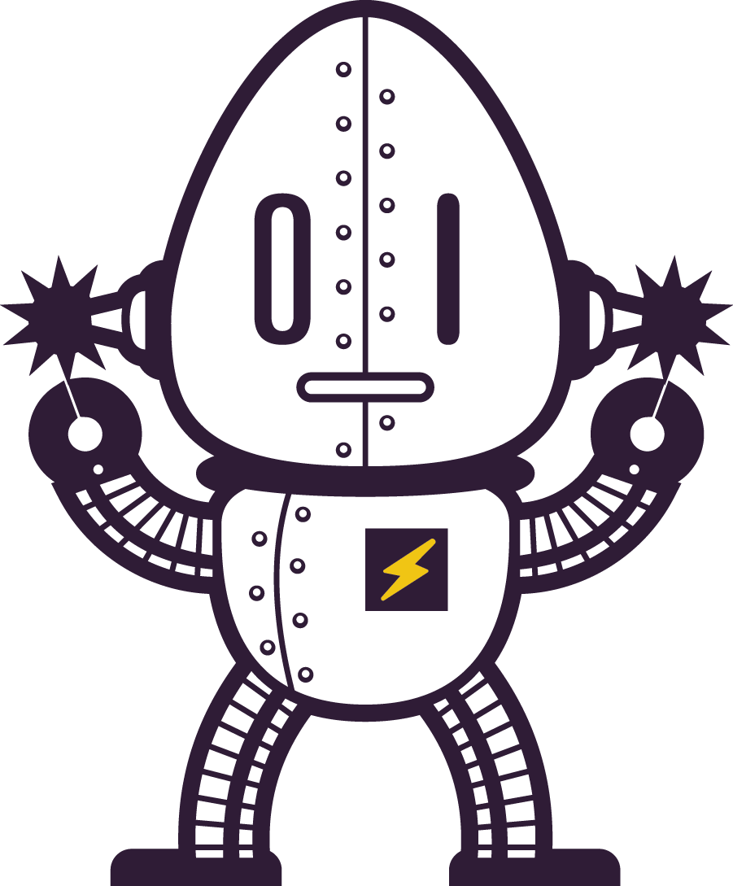

Operation Spark : Prep
===
## Welcome Agent!

We're super excited to start coding together and building websites, apps and games! 

Prep program is a collection of resources, coding exercises and projects that introduce you to the world of software development.

It is also designed to prepare you to take the next step in our training.

We want everyone to try their hand at software development! It is highly probable that if you enjoy this material, there's a fantastic career waiting for you in software engineering!

**To move on in our training, students must fully complete all eight steps of the Prep program**.  In doing so, you will exhibit the desire, commitment, grit and aptitude to succeed in our programming.

Please do all the steps, and do them in the proper order.

It should take you between 10 to 25 hours to complete and all steps must be complete _before_ you apply to Bootcamp.

Again, bear in mind, **the Prep material MUST BE 100% complete**, and we have our reasons for this requirement, one of which is that you will NEED to know this material come day one of Bootcamp, so please make note of this, and please do not let anyone tell you that you can skip any of these steps or any part of these steps.  

See the **Take Away** section for topics terms and concepts you should know by the end of the Prep program.  Make sure you understand all of the topics before taking the Bootcamp entrance interview.

Happy coding!
